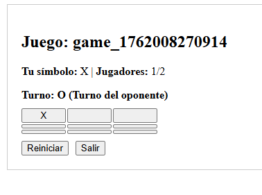
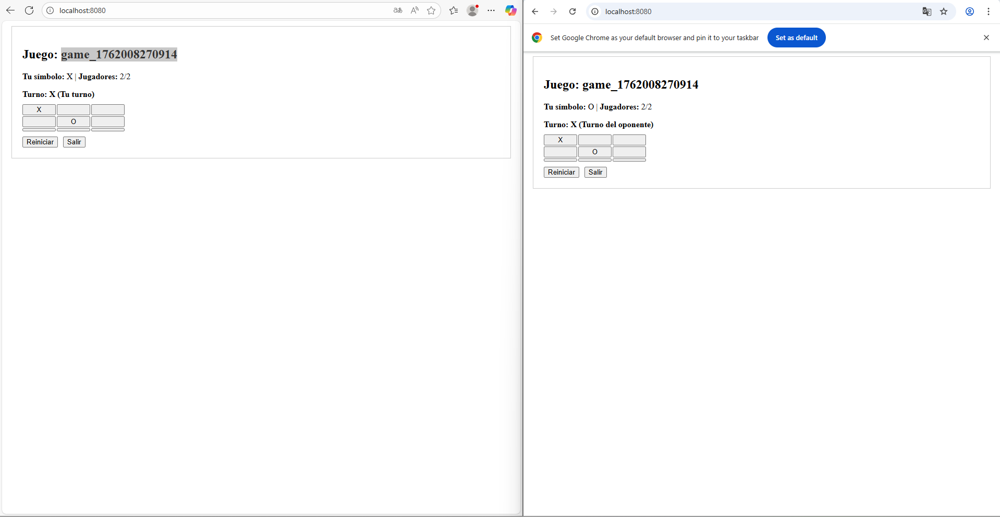
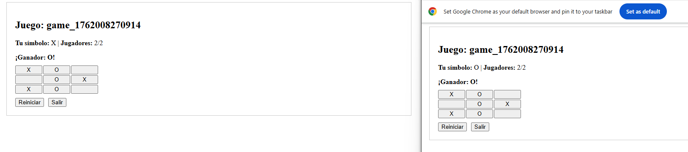

# Arquitecturas de Software (ARSW) - Parcial #2

## Tic Tac Toe con WebSockets

#### Nicolás Toro

[](https://www.oracle.com/java/)
[](https://maven.apache.org/)

---

En este repositorio se muestra la solucion al parcial #2 del curso de arquitectura de software (ARSW), se busca implementar
el juego tic tac toe con WebScockets, demostrando las habilidades técnicas adquiridas en el curso.


## Estructura del laboratorio

```bash
├───.idea
├───.mvn
│   └───wrapper
├───img
├───src
│   ├───main
│   │   ├───java
│   │   │   └───edu
│   │   │       └───eci
│   │   │           └───arsw
│   │   │               └───TicTacToe
│   │   │                   ├───config
│   │   │                   ├───handler
│   │   │                   └───model
│   │   └───resources
│   │       └───static
│   │           └───js
│   │               └───components
│   └───test
│       └───java
│           └───edu
│               └───eci
│                   └───arsw
│                       └───TicTacToe
└───target
    ├───classes
    │   ├───edu
    │   │   └───eci
    │   │       └───arsw
    │   │           └───TicTacToe
    │   │               ├───config
    │   │               ├───handler
    │   │               └───model
    │   └───static
    │       └───js
    │           └───components
    ├───generated-sources
    │   └───annotations
    ├───generated-test-sources
    │   └───test-annotations
    ├───maven-archiver
    ├───maven-status
    │   └───maven-compiler-plugin
    │       ├───compile
    │       │   └───default-compile
    │       └───testCompile
    │           └───default-testCompile
    ├───surefire-reports
    └───test-classes
        └───edu
            └───eci
                └───arsw
                    └───TicTacToe

```
---

### Ejecutar el Proyecto

A continuación, se describen los pasos para ejecutar ambos proyectos en cualquier sistema operativo compatible con Java y Maven.

#### 1. Requisitos previos

- **Java 17** o superior instalado y configurado en el `PATH`.
- **Apache Maven** instalado y configurado en el `PATH`.
- (Opcional) Un IDE como IntelliJ IDEA, Eclipse o VS Code para facilitar la edición y ejecución.

Verifica las versiones instaladas ejecutando en la terminal:

```bash
java -version
mvn -version
```

#### 2. Clonar el repositorio

Si aún no tiene el repositorio localmente, clónelo con:

```bash
git clone https://github.com/NicoToro25/ARSW-Parcial2-TicTacToeWebsockets.git
```

#### 3. Compilar los proyectos

Ejecutar el siguiente código

```bash
mvn clean package
```

#### 4. Ejecutar los proyectos

Ejecutar el siguiente código:

```bash
mvn exec:java@
```

> **Nota:** Si su IDE lo permite, también puede ejecutar directamente las clases principales desde la interfaz gráfica del IDE.

Si se tiene algún inconveniente con la ejecución, asegúrarse de que las variables de entorno de Java y Maven estén correctamente configuradas y de estar ubicado en la carpeta correspondiente antes de ejecutar los comandos.

---

## Enunciado

Teniendo como referencia el ejercicio propuesto para el parcial realice los siguientes pasos

1. Aprenda a construir un Juego Tic Tac Toe siguiendo el tutorial que se indica aquí: [Tutorial](https://reactjs.org/tutorial/tutorial.html#before-we-start-the-tutorial) (Repositorio ya construido)

2. A partir de este Juego construya una aplicación interactiva usando WebSockets que permita:

1. Crear una sala

2. Entrar a una sala

3. Jugar a dos jugadores en forma interactiva una partida de Tic Tac Toe

4. El sistema debe persistir las salas y el estado de Juego a una base de datos.

5. El sistema debe permitir retroceder en la historia en cada sala. Una sala recuperada de la base de datos debe traer sus historia y permitir por ejemplo retroceder en el juego normalmente.

Entregables:

1. Proyecto en GitHub, bien documentado.
2. El README debe contener toda la documentación y evidencias del funcionamiento (Pantallazos) SI NO HAY EVIDENCIAS LA NOTA ES 1.
   BONO: Desplegado en la nube.

---

## Solución

### Backend

1. Como primer paso, se crea el proyecto usando spring initializr y se modifica el pom.xml con las dependencias necesarias.
Se recomienda mirar el pom.xml y verificar las siguientes dependencias:

```` bash
		<dependency>
			<groupId>org.springframework.boot</groupId>
			<artifactId>spring-boot-starter-web</artifactId>
		</dependency>
		<dependency>
			<groupId>org.springframework.boot</groupId>
			<artifactId>spring-boot-starter-websocket</artifactId>
		</dependency>
````

2. Como en un comienzo el proyecto fue hecho con toda la lógica desde el FRONT, se migra dicha lógica al back.

(Se tuvo que configurar el JDK en la elaboración)

3. Se comienza identificando el modelo que consta de dos clases "Player" y "Game".

(Revisar en src/main/java/edu/eci/arsw/TicTacToe/model)

Se crea la clase player y se agregan los atributos principales getters y setters.

En la clase Game, se implemeta toda la lógica del juego,

4. Se agrega el handler que se encargará de gestionar las peticiones WebScockets.

(Revisar src/main/java/edu/eci/arsw/TicTacToe/handler/GameWebSocketHandler.java)

Se agregan todos los método necesarios para la gestión de peticiones.

6. Se añade la clase Config que configura el soporte para WebSockets en una aplicación Spring Boot.

(Revisar src/main/java/edu/eci/arsw/TicTacToe/config/WebSocketConfig.java)

---
### Front

1. Previamente se construyó todo el FRONT, se encuentra en la carpeta src/main/resources/static.

2. Para hacer los requisitos de crear una sala y que se puedan unir, se debe crear un script websocket-client.

Este código define una clase JavaScript llamada GameClient, es un cliente Websockets  necesario para comunicarse en tiempo real con un servidor.

(Revisar src/main/resources/static/js/websocket-client.js)

3. Se añade script con información del lobby, al necesitar la creación de varias salas, requiere este componente para la gestión de las mismas.

(Revisar src/main/resources/static/js/components/Lobby.js)

---

## Juego funcionando

Se ejecuta el código.

Vista del cliente 1:



Vista del cliente 2



Cuando gana un jugador.



